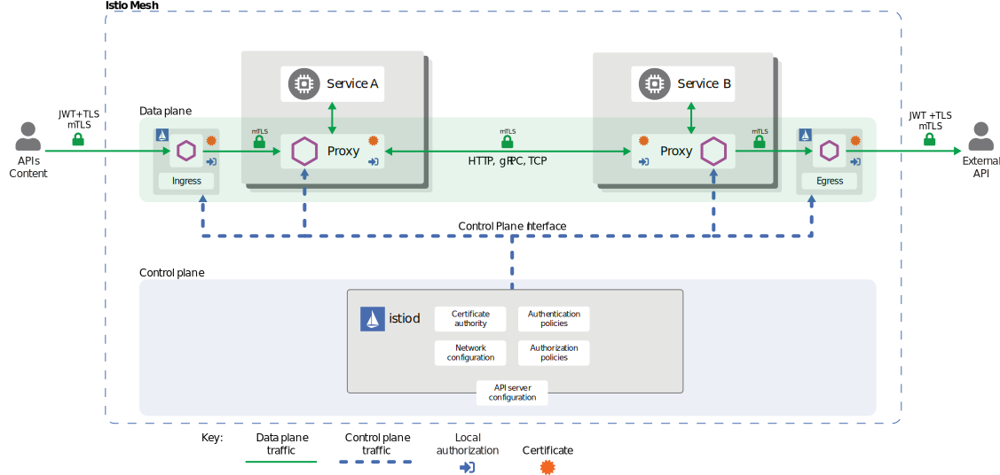

# Istio mTLS, Zero Trust Model Architecture

## High-level architecture
<p align="center">

</p>

**Istio provides two types of authentication:**

**Peer authentication:** used for service-to-service authentication to verify the client making the connection. Istio offers mutual TLS as a full stack solution for transport authentication, which can be enabled without requiring service code changes. This solution: 
* Provides each service with a strong identity representing its role to enable interoperability across clusters and clouds.
* Secures service-to-service communication. 
* Provides a key management system to automate key and certificate generation, distribution, and rotation.

**Request authentication:** Used for end-user authentication to verify the credential attached to the request. Istio enables request-level authentication with JSON Web Token (JWT) validation and a streamlined developer experience using a custom authentication provider or any OpenID Connect providers, for example:

* ORY Hydra
* Keycloak
* Auth0
* Firebase Auth
* Google Auth

# Kiali 
Kiali shows whole architecture diagram.
<p align="center">

</p>

## Verify mTLS setup
```bash
$ istioctl x describe pod frontend-6f4659999b-xhm8x
Pod: frontend-6f4659999b-xhm8x
   Pod Revision: default
   Pod Ports: 15090 (istio-proxy), 8080 (server)
--------------------
Service: frontend
   Port: http 80/HTTP targets pod port 8080
DestinationRule: defautl for "*.default.svc.cluster.local"
   Traffic Policy TLS Mode: ISTIO_MUTUAL
--------------------
Effective PeerAuthentication:
   Workload mTLS mode: STRICT
Applied PeerAuthentication:
   default.default
Skipping Gateway information (no ingress gateway pods)
```

**NOTE:** Check the destination pod to see if the destination endpoint has the label **tlsMode** equals to **istio**. For example, in the EDS response received, we see **frontend** pod endpoint has the **tlsMode** label.
```bash
$ IP=$(kubectl get pod -lapp=paymentservice -o jsonpath="{.items[*].status.podIP}")
10.1.0.174 (IP of paymentservice pod)

$ kubectl exec -it frontend-6f4659999b-xhm8x -c istio-proxy -- curl 'localhost:15000/config_dump?include_eds=true' | grep 10.1.0.174 -A15 -B5

        "lb_endpoints": [
         {
          "endpoint": {
           "address": {
            "socket_address": {
             "address": "10.1.0.174",
             "port_value": 50051
            }
           },
           "health_check_config": {}
          },
          "health_status": "HEALTHY",
          "metadata": {
           "filter_metadata": {
            "istio": {
             "workload": "paymentservice;default;paymentservice;;Kubernetes"
            },
            "envoy.transport_socket_match": {
             "tlsMode": "istio"
            }
           }
```

```bash
# also check for this annotation ("security.istio.io/tlsMode": "istio")
$ kubectl get pod -lapp=paymentservice -o jsonpath="{.items[*].status.podIP}"
$ kubectl exec -it paymentservice-68b9bf6696-bm662 -c istio-proxy -- curl 'localhost:15000/config_dump?include_eds=true' | grep <IP OF Paymentservice Pod> -A15 -B5
...
"security.istio.io/tlsMode": "istio",
...
```

## References

* [Google Online Boutique App Example](https://github.com/ankitcharolia/microservices-demo/tree/main)
* [Traffic encryption using Istio mTLS](https://www.istioworkshop.io/11-security/01-mtls/)
* [mTLS troubleshooting](https://github.com/istio/istio/wiki/Mutual-TLS-TroubleShooting)