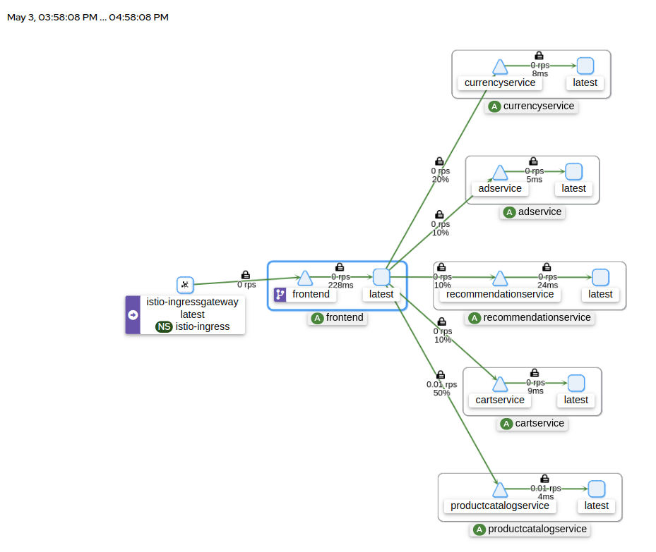

# Istio mTLS, Zero Trust Model Architecture

## High-level architecture

**Istio provides two types of authentication:**

**Peer authentication:** used for service-to-service authentication to verify the client making the connection. Istio offers mutual TLS as a full stack solution for transport authentication, which can be enabled without requiring service code changes. This solution: 
* Provides each service with a strong identity representing its role to enable interoperability across clusters and clouds.
* Secures service-to-service communication. 
* Provides a key management system to automate key and certificate generation, distribution, and rotation.

**Request authentication:** Used for end-user authentication to verify the credential attached to the request. Istio enables request-level authentication with JSON Web Token (JWT) validation and a streamlined developer experience using a custom authentication provider or any OpenID Connect providers, for example:

* ORY Hydra
* Keycloak
* Auth0
* Firebase Auth
* Google Auth

# Kiali 
Kiali shows whole architecture diagram.

## References

* [Google Online Boutique App Example](https://github.com/ankitcharolia/microservices-demo/tree/main)
* [Traffic encryption using Istio mTLS](https://www.istioworkshop.io/11-security/01-mtls/)